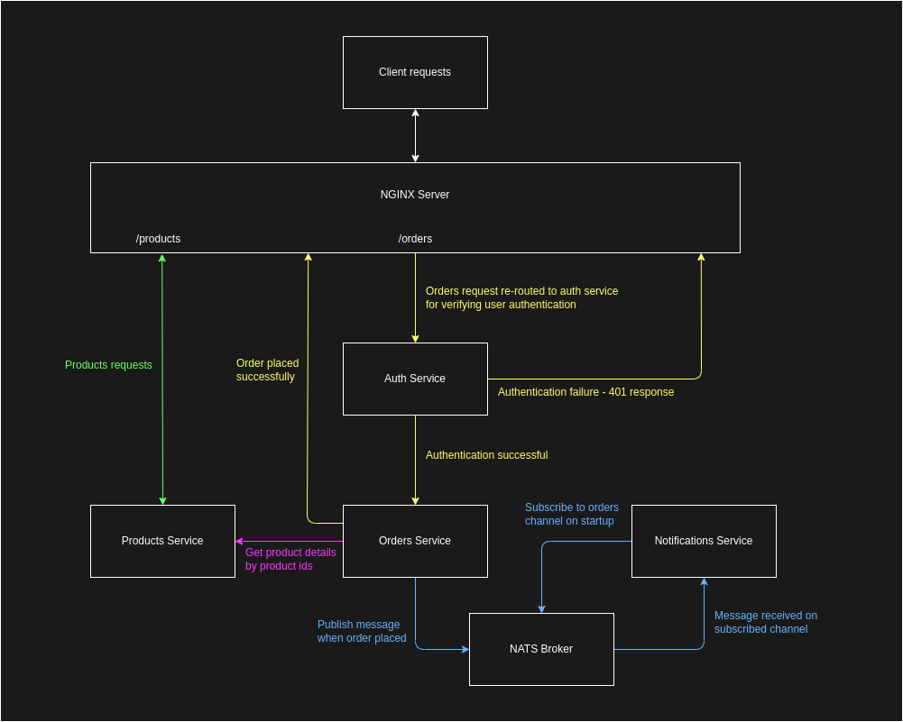

My adaptation of **Sainig**'s app code.
Original readme and article:

> *This is a simple ecommerce application backend built using the microservices architecture. [Here's](https://dev.to/sainig/series/23469) a series of articles I'm writing to document my journey throught the process.*
---

## Runing the application
`docker-compose up`  
Test with:  
`curl http://localhost/products/?ids=2,3`  

``` bash
curl http://localhost/orders/ \
    --header 'Authorization: secret-auth-token' \
    --header 'Content-Type: application/json' \
    --data '{
        "userId": "saini-g",
        "productIds": ["2", "4"]
    }'
```

## Application Design



---

## Technologies & Tools Used
- [Node.js](https://nodejs.org/)
- [Python](https://www.python.org/)
- [Docker](https://www.docker.com/) & [docker-compose](https://docs.docker.com/compose/)
- [Nginx](https://www.nginx.com/)
- [Nats](https://github.com/nats-io/nats.js)
